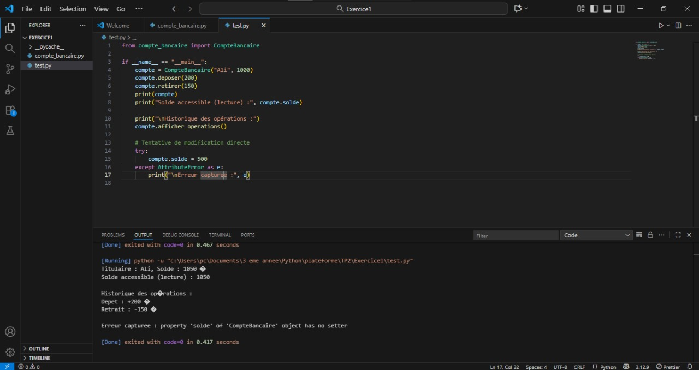
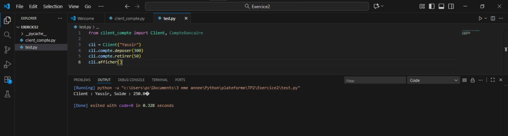

# 🧱 TP 2 : Encapsulation – Programmation Orientée Objet (Python)

Ce TP illustre les principes fondamentaux de l’**encapsulation** en Python :  
- Attributs protégés (`_attribut`) et privés (`__attribut`)  
- Propriétés pour contrôler l’accès aux données  
- Validation et protection des valeurs  
- Relations entre classes par **composition**  

---

## 🧩 **Exercice 1 — Compte Bancaire (Encapsulation et Validation)**

### 🎯 Objectif pédagogique :
Appliquer les principes d’encapsulation :  
- protéger les attributs d’un objet,  
- utiliser `@property` pour un accès en lecture seule,  
- valider les données saisies,  
- interdire la modification directe du solde.

### 📜 Fichiers :
- `compte_bancaire.py`
- `test.py`

### 📂 Structure :
````
### 📂 Structure :
Exercice1/
│
├── compte_bancaire.py
├── test.py
````
### Résultat visuel
<div align="center">  <p><em>Figure 1</em></p> </div>
## 🧩 **Exercice 2 — Composition : Client et Compte Bancaire**

### 🎯 Objectif pédagogique :
Mettre en œuvre la **composition entre classes** :  
un `Client` possède un ou plusieurs `CompteBancaire`.  
Ce modèle illustre une relation « a un » (un client **a un compte**).

### 📜 Fichiers :
- `client_compte.py`
- `test.py`

### 📂 Structure :
````
Exercice2/
│
├── client_compte.py
├── test.py
````
### Résultat visuel
<div align="center">  <p><em>Figure 2</em></p> </div>
## 🚀 **Exécution**

```bash
python test.py
````
